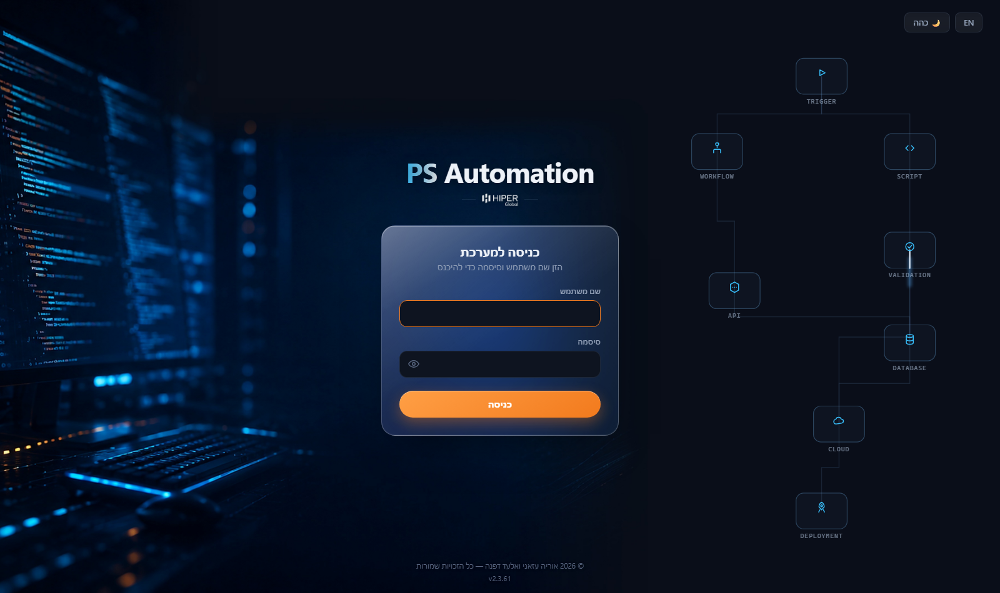
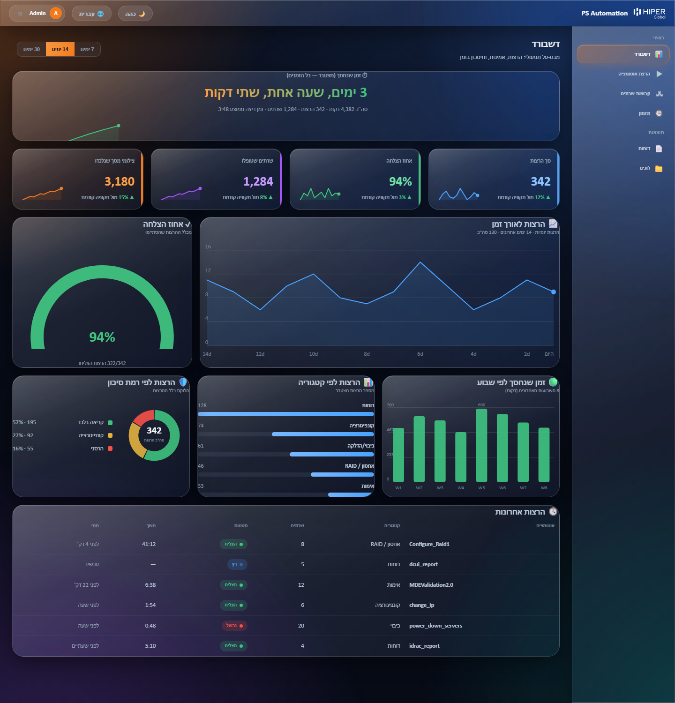
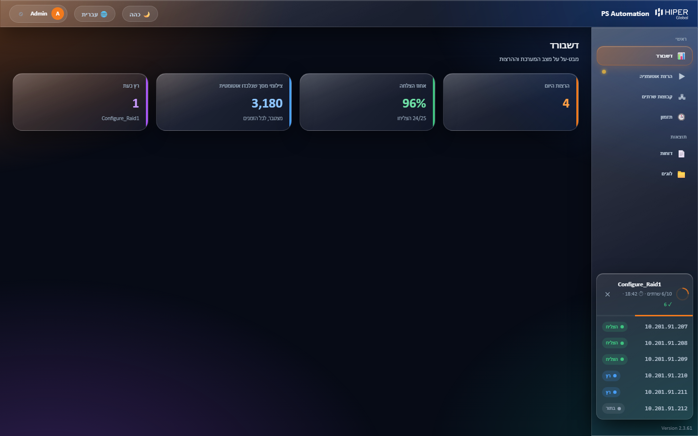

<div align="center">

# ⚡ PS Automation

**Infrastructure validation & automation platform for HIPER Global**

*One web app. Every server. Minutes, not hours.*


<br>



</div>

<br>

## Table of Contents

- [The Problem](#the-problem)
- [The Solution](#the-solution)
- [Key Features](#key-features)
- [Screenshots](#screenshots)
- [Automations Catalog](#automations-catalog)
- [Time Saved — Measured, Not Guessed](#time-saved--measured-not-guessed)
- [Architecture](#architecture)
- [Security](#security)
- [Requirements](#requirements)
- [Roadmap](#roadmap)
- [Ownership](#ownership)

<br>

## The Problem

Validating and configuring server infrastructure (Dell iDRAC, VMware ESXi, Red Hat) used to mean:

- **Connecting to every server manually, one at a time** — iDRAC, ESXi, or SSH — with no shortcuts.
- **Manual screenshots and documentation** — open Word, paste a screenshot, write a caption, repeat for every server and every check.
- **Human error built into the process** — a forgotten screenshot, a mistyped IP, a wrong caption.
- **No single source of truth** — no consistent record of what was run, when, or by whom.
- **Destructive operations (power actions, RAID builds) done by hand**, server by server, with no readiness check and no second confirmation before something irreversible happens.

None of this scales past a handful of servers, and every manual step is a chance for something to go wrong.

<br>

## The Solution

**PS Automation** is a single internal web application that unifies every infrastructure automation for the Cognyte project (and beyond) under one guided interface:

- Pick an automation from a categorized catalog.
- Target one server or a hundred — ranges and lists both work.
- A **pre-flight check** confirms reachability and environment readiness before anything runs.
- Every run streams a **live console** and a **live floating status window** you can see from *any* page in the app.
- Destructive actions require **explicit double-confirmation** — never a single click.
- Every result — per server, every time — is saved automatically, with zero extra effort.

What used to take an engineer an afternoon, server by server, now runs on **dozens of servers in parallel**, unattended, with a full report waiting at the end.

<br>

## Key Features

| | |
|---|---|
| 🧭 **Guided Wizard** | Pick automation → set targets → pre-flight check → confirm & run. No automation is one accidental click away. |
| ⚙️ **Parallel Execution** | Automations fan out across many servers at once instead of one-by-one — a 10-server job finishes in the time of one. |
| 📡 **Live Monitoring, Anywhere** | A real-time console plus a floating "Job Tray" that follows you across every page — see progress without staying on the run screen. |
| 🛡️ **Destructive-Action Gate** | RAID builds, power actions, and other irreversible operations require explicit double-confirmation before they touch anything. |
| 📊 **Time-Saved Analytics** | The dashboard tracks cumulative time saved automatically, broken down by day/hour/minute — a live, defensible number for management. |
| 💾 **RAID Builder with Live Disk Picker** | Reads a server's physical disks (slot, size, media, bus, state) and lets you build RAID 0/1/5/6/10 — multiple arrays at once, applied together in a single reboot whenever the controller allows it. |
| 🔐 **Encrypted Credentials** | Default credentials are encrypted at rest and decrypted only in memory — never stored or logged as plaintext. |
| 🌗 **Bilingual, Dual-Theme UI** | Full Hebrew (RTL) and English support, dark and light themes, built on a custom "Liquid Glass" design system. |
| 📁 **Automatic Reporting** | Every run produces a dated report folder — Word/CSV outputs, per-server logs, and a consolidated run log — with no manual filing. |
| 🕐 **Full Audit Trail** | Every run, every server, every outcome is recorded automatically — who ran what, when, and what happened. |

<br>

## Screenshots

<table>
<tr>
<td width="50%">

**Dashboard — everything at a glance**

Time saved, success rate, run history, and category/risk breakdowns — computed automatically from real run data.

</td>
<td width="50%">

</td>
</tr>
<tr>
<td width="50%">

**Live Job Tray — like a CI pipeline, for infrastructure**

A floating window shows per-server status in real time from anywhere in the app — click it to jump straight into the live run, or stop the job with one click.

</td>
<td width="50%">

</td>
</tr>
</table>

<br>

## Automations Catalog

| Category | Automations |
|---|---|
| 📸 **Reports** | iDRAC system report · DCUI network report · VMware ESXi Host Client report · Windows validation report — every screenshot captured and filed automatically |
| ⚙️ **Configuration** | Change iDRAC IP · Set/verify iDRAC hostname · Configure NTP + DNS (Red Hat) · ESXi host configuration |
| 💾 **Storage / RAID** | Build RAID 0/1/5/6/10 with a live disk picker · Convert disks to Non-RAID |
| 🔌 **Power** | Power on / power off, fleet-wide |
| 🛡️ **Validation** | MDE / ATP compliance validation over SSH |

Every automation runs through the same guided wizard, the same pre-flight checks, and the same live monitoring — regardless of what it does under the hood.

<br>

## Time Saved — Measured, Not Guessed

The dashboard's headline metric isn't an estimate typed in once — it's computed automatically, per run, from real automation data:

> **Time saved = (manual time − automated time) × servers that actually succeeded.**
> A run with *any* failure — even a single server — adds **zero**. The number only ever reflects real, verified savings, and it never resets on a version upgrade.

| Automation | Time saved per server |
|---|---:|
| Configure RAID1 + UEFI | **10 min** |
| VMware ESXi Host Client Report | **9 min** |
| ESXi Host Configuration | **9 min** |
| MDE / ATP Validation | **9 min** |
| iDRAC System Report | **6 min** |
| Convert to Non-RAID | **5 min** |
| Windows Validation Report | **5 min** |
| Configure NTP + DNS | **4.5 min** |
| DCUI Network Report | **3 min** |
| Change IP / Set Hostname | **2.5 min** |
| Get iDRAC Hostname (verify) | **1.5 min** |
| Power On / Power Off | **1.5 min** |
| Ping Check | **0.5 min** |

Scale that across a real fleet: building RAID1 on 10 servers by hand is roughly 200 minutes of manual work — done in parallel through PS Automation, it's a fraction of that, unattended.

<br>

## Architecture

```
┌──────────────────────────────────────────────────────────────┐
│  Browser (any machine on the network)                        │
│  Vanilla HTML/CSS/JS · RTL Hebrew + English · Live SSE feed  │
└──────────────────────────────┬───────────────────────────────┘
                               │ HTTP / Server-Sent Events
┌──────────────────────────────▼───────────────────────────────┐
│  Flask backend (server.py)                                   │
│  Run orchestration · history · encrypted credentials ·       │
│  live status API · persistent analytics                      │
└──────────────────────────────┬───────────────────────────────┘
                               │ subprocess
┌──────────────────────────────▼───────────────────────────────┐
│  Automation engines (PowerShell + Python)                    │
│  racadm · plink/SSH · Selenium · Tkinter (interactive tools) │
└──────────────────────────────┬───────────────────────────────┘
                               │ network
┌──────────────────────────────▼───────────────────────────────┐
│  Target infrastructure                                       │
│  Dell iDRAC · VMware ESXi · Red Hat servers                  │
└──────────────────────────────────────────────────────────────┘
```

- **Backend:** Python (Flask), running natively on Windows — deliberately not containerized, since the automation layer depends on Dell RACADM, PowerShell, and native GUI automation that don't translate to a portable container.
- **Frontend:** No framework — vanilla HTML/CSS/JS, a custom "Liquid Glass" design system, full RTL Hebrew and English localization, dark and light themes.
- **Live updates:** Server-Sent Events stream console output in real time; a global floating "Job Tray" widget mirrors run status on every page.
- **Storage:** JSON-based (run history, settings, target groups) plus a persistent analytics store kept **outside** the application folder, so cumulative metrics survive every version upgrade.

<br>

## Security

- **No plaintext credentials, anywhere** — default credentials are encrypted at rest and decrypted only in memory at runtime.
- **Double-confirmation gate** before any destructive action (RAID builds, power operations, critical configuration changes).
- **Pre-flight checks** before every run — target reachability and environment readiness, verified before anything executes.
- **Full, tamper-resistant audit trail** — every run, every server, every result, logged automatically with no manual step to forget.
- **Login hardening** — lockout after repeated failed attempts, automatic idle logout, and tamper-evident licensing safeguards built into the application itself.

<br>

## Requirements

- Windows (Server or 11 Pro) with Python 3.x
- Dell OpenManage / RACADM tools (for iDRAC automations)
- Google Chrome + a matching ChromeDriver (for screenshot-based reports)
- Network access to the target iDRAC / ESXi / Red Hat infrastructure

<br>

## Roadmap

- [x] Unified web catalog for all Cognyte automations
- [x] Live "Job Tray" monitoring from any page
- [x] Automatic, persistent time-saved analytics
- [x] Interactive RAID builder with live disk picker (RAID 0/1/5/6/10, multiple arrays at once)
- [ ] Expand to Nova and Applied client projects
- [ ] Grafana-style analytics dashboard (charts, trends, per-category breakdowns)
- [ ] CI/CD pipeline for automatic deployment on code changes

<br>

## Ownership

**© 2026 Uriya Azani & Elad Dafna — All Rights Reserved.**
Internal tool built for HIPER Global / Cognyte infrastructure operations. Not licensed for external use or redistribution.

<div align="center">

<br>

**PS Automation** • HIPER Global

</div>
